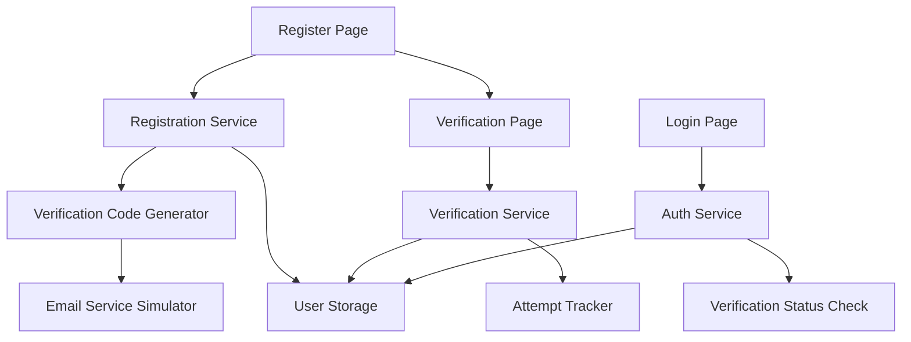

# Design Document: Email Verification Registration

## Overview

This design document specifies the technical implementation for adding email verification to the user registration process. The system will generate and validate 6-digit numeric verification codes, send them via email, and enforce verification before allowing account access.

### Key Design Decisions

**Frontend-Only Implementation**: Since this is a localStorage-based application without a backend, email sending will be simulated through console logging and UI display. In a production environment with a backend, this would integrate with an email service provider (e.g., SendGrid, AWS SES, Mailgun).

**Security Model**: The implementation balances security with the constraints of a frontend-only architecture. Rate limiting and attempt tracking will be stored in localStorage, which can be circumvented by determined attackers. This design is suitable for development/demo purposes but would require backend enforcement for production use.

**User Experience**: The verification flow prioritizes clarity and ease of use, with clear error messages, countdown timers, and resend functionality to handle common issues like email delays or code expiration.

### Research Summary

Based on industry best practices ([source](https://thecopenhagenbook.com/email-verification), [source](https://arkesel.com/otp-expiration-rate-limiting-best-practices/)):

- **Code Length**: 6-digit numeric codes provide adequate security when combined with expiration and rate limiting
- **Expiration Time**: 15 minutes is appropriate for email verification, accounting for email delivery delays while maintaining security ([source](https://arkesel.com/otp-expiration-rate-limiting-best-practices/))
- **Rate Limiting**: Industry standard is 5 attempts before requiring code resend ([source](https://handbook.login.gov/articles/identity-proofing-rate-limiting.html))
- **Resend Cooldown**: 60-second cooldown prevents abuse while allowing legitimate users to request new codes

## Architecture

### System Components



### Data Flow

1. **Registration Flow**:
   - User submits registration form
   - System validates email format
   - System generates 6-digit code
   - System creates pending user account
   - System stores verification data
   - System simulates email sending
   - User redirected to verification page

2. **Verification Flow**:
   - User enters 6-digit code
   - System validates code and expiration
   - System checks attempt count
   - On success: activate account and create session
   - On failure: increment attempts and show error

3. **Resend Flow**:
   - User clicks resend button
   - System checks cooldown period
   - System invalidates old code
   - System generates new code
   - System resets attempt counter

## Components and Interfaces

### 1. Verification Code Generator

**Purpose**: Generate secure random 6-digit numeric codes

**Interface**:
```javascript
/**
 * Generates a 6-digit numeric verification code
 * @returns {string} 6-digit code as string
 */
function generateVerificationCode(): string
```

**Implementation Notes**:
- Use `Math.random()` for code generation
- Ensure code is always 6 digits (pad with leading zeros if needed)
- Return as string to preserve leading zeros

### 2. Email Service Simulator

**Purpose**: Simulate email sending for development environment

**Interface**:
```javascript
/**
 * Simulates sending verification email
 * @param {string} email - Recipient email address
 * @param {string} code - 6-digit verification code
 * @returns {Promise<{success: boolean, error?: string}>}
 */
function sendVerificationEmail(email, code): Promise<Result>
```

**Implementation Notes**:
- Log email content to console for development
- Display code in UI for testing purposes
- Return success immediately (no actual email sending)
- In production, this would call an email service API

### 3. Verification Service

**Purpose**: Manage verification code validation and attempt tracking

**Interface**:
```javascript
/**
 * Validates verification code for an email
 * @param {string} email - User's email address
 * @param {string} code - Code entered by user
 * @returns {{success: boolean, error?: string}}
 */
function verifyCode(email, code): Result

/**
 * Checks if verification code has expired
 * @param {string} email - User's email address
 * @returns {boolean}
 */
function isCodeExpired(email): boolean

/**
 * Gets remaining attempts for verification
 * @param {string} email - User's email address
 * @returns {number}
 */
function getRemainingAttempts(email): number

/**
 * Generates and stores new verification code
 * @param {string} email - User's email address
 * @returns {{code: string, expiresAt: number}}
 */
function generateAndStoreCode(email): CodeData

/**
 * Invalidates existing code and generates new one
 * @param {string} email - User's email address
 * @returns {{success: boolean, code?: string, error?: string}}
 */
function resendCode(email): Result
```

### 4. Verification Page Component

**Purpose**: UI for entering and validating verification codes

**Props**:
```javascript
{
  email: string,           // Email address to verify
  onVerified: () => void,  // Callback when verification succeeds
  onNavigate: (page: string) => void  // Navigation handler
}
```

**State**:
```javascript
{
  code: string,              // User input (6 digits)
  error: string,             // Error message
  loading: boolean,          // Submission state
  timeRemaining: number,     // Seconds until expiration
  canResend: boolean,        // Resend button enabled state
  resendCooldown: number,    // Seconds until can resend
  attemptsRemaining: number  // Verification attempts left
}
```

### 5. Registration Service Updates

**Purpose**: Extend existing registration to support verification

**New Functions**:
```javascript
/**
 * Creates pending user account (unverified)
 * @param {Object} userData - User registration data
 * @returns {{success: boolean, user?: Object, error?: string}}
 */
function createPendingUser(userData): Result

/**
 * Activates user account after verification
 * @param {string} email - User's email address
 * @returns {{success: boolean, user?: Object, error?: string}}
 */
function activateUser(email): Result
```

### 6. Auth Service Updates

**Purpose**: Prevent login for unverified accounts

**Modified Function**:
```javascript
/**
 * Login with verification check
 * @param {string} email
 * @param {string} password
 * @returns {{success: boolean, user?: Object, message?: string, needsVerification?: boolean}}
 */
function login(email, password): Result
```

## Data Models

### User Model Extension

```javascript
{
  id: string,
  email: string,
  password: string,
  name: string,
  // ... existing fields ...
  verified: boolean,        // NEW: Verification status
  createdAt: number,        // NEW: Account creation timestamp
  // ... other fields ...
}
```

### Verification Data Model

**Storage Key**: `lu_verification_{email}`

```javascript
{
  email: string,
  code: string,              // 6-digit verification code
  expiresAt: number,         // Timestamp when code expires
  attempts: number,          // Number of verification attempts
  lastResendAt: number,      // Timestamp of last resend
  createdAt: number          // Timestamp when code was generated
}
```

### Storage Structure

```
localStorage:
  - lu_users: Array<User>                    // User accounts
  - lu_verification_{email}: VerificationData // Per-email verification data
  - lu_session: {userId: string} | null      // Current session
```

## Correctness Properties

*A property is a characteristic or behavior that should hold true across all valid executions of a system—essentially, a formal statement about what the system should do. Properties serve as the bridge between human-readable specifications and machine-verifiable correctness guarantees.*

Before defining the correctness properties, I need to analyze the acceptance criteria to determine which are suitable for property-based testing.


### Property 1: Registration Creates Complete Pending User

*For any* valid registration data (name, email, password, university, field), the registration process SHALL create a pending user account with:
- A 6-digit numeric verification code
- Verification data stored with email, code, and expiration timestamp
- Expiration time set to exactly 15 minutes (900000ms) from creation
- User verified status set to false
- No session created

**Validates: Requirements 1.1, 1.2, 1.3, 1.4, 1.5**

### Property 2: Code Validation Logic

*For any* email and submitted code pair, the verification service SHALL:
- Return success if the submitted code matches the stored code AND the code has not expired
- Return a "wrong_code" error if the submitted code does not match the stored code
- Correctly compare codes regardless of leading zeros or string formatting

**Validates: Requirements 4.1, 4.2, 4.3**

### Property 3: Expired Code Detection

*For any* verification code with an expiration timestamp in the past, the verification service SHALL return an "expired" error when the code is submitted, regardless of whether the code itself matches.

**Validates: Requirements 4.4, 7.1**

### Property 4: Attempt Limiting

*For any* email address, after 5 failed verification attempts, the verification service SHALL block further verification attempts and require a code resend before allowing additional attempts.

**Validates: Requirements 4.5**

### Property 5: Successful Verification Activates Account

*For any* pending user who successfully verifies their code, the system SHALL:
- Set the user's verified status to true
- Create a session for the user
- Delete the verification data from storage
- All three actions must complete for any successful verification

**Validates: Requirements 5.1, 5.2, 5.3**

### Property 6: Unverified Users Cannot Login

*For any* user account with verified status set to false, login attempts with correct credentials SHALL be rejected with a "not_verified" error, regardless of password correctness.

**Validates: Requirements 5.5, 8.1**

### Property 7: Resend Generates Valid New Code

*For any* email address with an existing verification code, the resend operation SHALL:
- Generate a new 6-digit numeric code
- Invalidate the previous code (old code no longer works)
- Set expiration to exactly 15 minutes from the resend time
- Reset the attempt counter to 0

**Validates: Requirements 6.1, 6.2, 6.4**

### Property 8: Resend Cooldown Enforcement

*For any* email address, if a resend request is made within 60 seconds of the previous resend, the system SHALL reject the request with a "cooldown" error and not generate a new code.

**Validates: Requirements 6.5**

### Property 9: Account Expiration and Cleanup

*For any* pending user account created more than 24 hours ago without verification:
- The account SHALL be marked as expired
- A new registration with the same email SHALL succeed
- The old expired account SHALL be deleted when the new registration occurs
- The new registration SHALL create fresh verification data

**Validates: Requirements 9.1, 9.2, 9.3**

### Property 10: Email Validation

*For any* string submitted as an email during registration:
- Valid email formats (including subdomains and plus addressing) SHALL be accepted
- Invalid formats (missing @, missing domain, invalid characters) SHALL be rejected
- Rejected emails SHALL not create a pending user account
- Rejected emails SHALL return a descriptive error message

**Validates: Requirements 10.1, 10.4, 10.5**

### Property 11: Time Calculation Accuracy

*For any* verification code with a known creation timestamp, the system SHALL accurately calculate:
- Remaining time until expiration (expiresAt - currentTime)
- Time elapsed since creation (currentTime - createdAt)
- Both calculations must be accurate within 1 second

**Validates: Requirements 3.4, 7.4**

## Error Handling

### Error Types and Responses

| Error Type | Trigger Condition | User Message | System Action |
|------------|------------------|--------------|---------------|
| `email_exists` | Email already registered and verified | "This email is already registered. Please log in." | Prevent registration, suggest login |
| `email_invalid` | Email format validation fails | "Please enter a valid email address." | Block registration, show inline error |
| `wrong_code` | Submitted code doesn't match stored code | "Incorrect verification code. {X} attempts remaining." | Increment attempt counter |
| `expired` | Code expiration time has passed | "This code has expired. Please request a new one." | Enable resend button |
| `too_many_attempts` | 5 failed attempts reached | "Too many incorrect attempts. Please request a new code." | Block verification, require resend |
| `cooldown_active` | Resend requested within 60 seconds | "Please wait {X} seconds before requesting a new code." | Disable resend button |
| `not_verified` | Unverified user attempts login | "Please verify your email address first." | Show verification link |
| `email_send_failed` | Email service fails (simulated) | "Failed to send verification email. Please try again." | Allow retry |

### Error Recovery Flows

**Expired Code**:
1. User sees expiration message
2. Resend button automatically enabled
3. User clicks resend
4. New code generated and sent
5. Timer resets to 15 minutes

**Too Many Attempts**:
1. User sees attempt limit message
2. Verification input disabled
3. Resend button enabled
4. User must request new code
5. Attempt counter resets with new code

**Cooldown Active**:
1. User sees cooldown message with countdown
2. Resend button disabled
3. Countdown timer displays remaining seconds
4. Button re-enables after cooldown expires

**Unverified Login Attempt**:
1. User sees verification required message
2. Link to verification page provided
3. Option to resend code if needed
4. User completes verification
5. Redirected back to login or auto-logged in

### Validation Rules

**Email Validation**:
```javascript
// Must contain exactly one @ symbol
// Must have characters before and after @
// Domain must have at least one dot
// Accepts: user@domain.com, user+tag@sub.domain.com
// Rejects: user@, @domain.com, user@domain, user@@domain.com
```

**Code Validation**:
```javascript
// Must be exactly 6 characters
// Must contain only digits 0-9
// Leading zeros are preserved
// Accepts: "123456", "000001", "999999"
// Rejects: "12345", "1234567", "12a456", ""
```

**Timing Validation**:
```javascript
// Code expiration: exactly 15 minutes (900000ms)
// Resend cooldown: exactly 60 seconds (60000ms)
// Account expiration: exactly 24 hours (86400000ms)
// All timestamps use Date.now() for consistency
```

## Testing Strategy

### Dual Testing Approach

This feature will use both property-based testing and example-based unit testing for comprehensive coverage:

**Property-Based Tests**: Verify universal properties across randomized inputs
- Minimum 100 iterations per property test
- Each test tagged with feature name and property number
- Tests core business logic and validation rules

**Unit Tests**: Verify specific examples, edge cases, and UI behavior
- Specific scenarios that demonstrate correct behavior
- Edge cases (empty inputs, boundary values)
- UI component rendering and interaction
- Integration points between components

### Property-Based Testing Configuration

**Library**: fast-check (already in package.json)

**Test Structure**:
```javascript
import fc from 'fast-check';

// Feature: email-verification-registration, Property 1: Registration Creates Complete Pending User
test('registration creates complete pending user', () => {
  fc.assert(
    fc.property(
      fc.record({
        name: fc.string({ minLength: 1 }),
        email: fc.emailAddress(),
        password: fc.string({ minLength: 8 }),
        university: fc.string(),
        field: fc.string({ minLength: 1 })
      }),
      (userData) => {
        // Test implementation
      }
    ),
    { numRuns: 100 }
  );
});
```

**Generators Needed**:
- Valid email addresses (built-in `fc.emailAddress()`)
- Invalid email strings (custom generator)
- 6-digit codes (custom generator)
- Timestamps (past, present, future)
- User registration data (composite generator)

### Unit Test Coverage

**Registration Flow**:
- Valid registration creates pending user
- Duplicate email shows error
- Invalid email format shows error
- Password requirements enforced
- Navigation to verification page

**Verification Flow**:
- Correct code activates account
- Wrong code shows error and decrements attempts
- Expired code shows error and enables resend
- 5 failed attempts blocks verification
- Successful verification creates session

**Resend Flow**:
- Resend generates new code
- Old code no longer works after resend
- Cooldown prevents rapid resends
- Resend resets attempt counter

**Login Flow**:
- Verified users can log in
- Unverified users cannot log in
- Unverified login shows verification link

**UI Components**:
- Verification page displays email
- Countdown timer updates correctly
- Resend button enables/disables appropriately
- Error messages display correctly
- Input validation provides feedback

### Integration Testing

Since this is a frontend-only implementation, integration tests will focus on:
- Component interaction (Register → Verification → Dashboard)
- localStorage persistence and retrieval
- State management across page navigation
- Error handling across component boundaries

### Test Data Management

**Mock Data**:
```javascript
const mockUsers = {
  verified: { email: 'verified@test.com', verified: true },
  pending: { email: 'pending@test.com', verified: false },
  expired: { email: 'expired@test.com', createdAt: Date.now() - 25 * 60 * 60 * 1000 }
};

const mockCodes = {
  valid: { code: '123456', expiresAt: Date.now() + 900000 },
  expired: { code: '654321', expiresAt: Date.now() - 1000 },
  cooldown: { lastResendAt: Date.now() - 30000 }
};
```

**Test Isolation**:
- Clear localStorage before each test
- Reset all timers and intervals
- Mock Date.now() for time-dependent tests
- Restore mocks after each test

## Implementation Notes

### Development vs Production

**Current Implementation (Development)**:
- Email sending simulated via console.log
- Verification codes displayed in UI for testing
- All data stored in localStorage
- No actual email service integration

**Production Requirements**:
- Integrate email service provider (SendGrid, AWS SES, Mailgun)
- Move verification logic to backend API
- Store verification data in database
- Implement server-side rate limiting
- Add CAPTCHA for registration
- Use secure random number generation
- Implement email delivery monitoring

### Security Considerations

**Current Limitations**:
- localStorage can be manipulated by users
- Rate limiting can be bypassed by clearing localStorage
- No protection against automated attacks
- Verification codes visible in browser console

**Production Security**:
- Backend validation of all verification attempts
- Server-side rate limiting with IP tracking
- Secure random code generation (crypto.randomBytes)
- Email delivery confirmation
- Account lockout after repeated failures
- Audit logging of verification attempts

### Performance Considerations

**localStorage Operations**:
- Minimize reads/writes during verification
- Batch updates when possible
- Clean up expired data periodically

**Timer Management**:
- Use single interval for countdown updates
- Clear intervals on component unmount
- Avoid memory leaks from abandoned timers

**Code Generation**:
- Generate codes synchronously (no async needed)
- Cache generated codes to avoid regeneration
- Validate codes efficiently with direct comparison

### Accessibility

**Verification Page**:
- Clear labels for code input
- Error messages announced to screen readers
- Countdown timer updates announced
- Keyboard navigation support
- Focus management after errors

**Error Messages**:
- Use ARIA live regions for dynamic updates
- Provide clear, actionable error text
- Associate errors with form fields
- Maintain focus on error correction

### Internationalization

**Text Content**:
- All user-facing text in translation files
- Support for multiple languages
- Format timestamps according to locale
- Number formatting for countdown timers

**Email Templates**:
- Localized email content
- Support for RTL languages
- Culturally appropriate messaging

## Future Enhancements

### Phase 2 Features

1. **Email Service Integration**
   - Connect to real email service provider
   - Email delivery tracking and retry logic
   - Bounce handling and email validation

2. **Enhanced Security**
   - Backend API for verification logic
   - Database storage for verification data
   - Server-side rate limiting
   - CAPTCHA integration

3. **User Experience Improvements**
   - Auto-fill verification code from email
   - SMS verification as alternative
   - Social login integration
   - Remember device functionality

4. **Admin Features**
   - Dashboard for verification metrics
   - Manual verification override
   - Bulk user verification
   - Verification audit logs

### Scalability Considerations

**Current Scale**: Suitable for development and small-scale demos

**Production Scale Requirements**:
- Backend API to handle concurrent verifications
- Database with proper indexing for fast lookups
- Email queue for reliable delivery
- Caching layer for frequently accessed data
- Monitoring and alerting for verification failures

## Appendix

### Related Files

**New Files**:
- `src/pages/VerifyEmail.jsx` - Verification page component
- `src/services/verification.js` - Verification service functions
- `src/test/verification.property.test.js` - Property-based tests
- `src/test/verification.test.js` - Unit tests

**Modified Files**:
- `src/pages/Register.jsx` - Add verification flow
- `src/pages/Login.jsx` - Add verification check
- `src/services/db.js` - Add verification functions
- `src/context/AuthContext.jsx` - Update login logic
- `public/locales/*/translation.json` - Add verification text

### References

- [Email Verification Best Practices](https://thecopenhagenbook.com/email-verification)
- [OTP Expiration and Rate Limiting](https://arkesel.com/otp-expiration-rate-limiting-best-practices/)
- [Identity Verification Rate Limiting](https://handbook.login.gov/articles/identity-proofing-rate-limiting.html)
- [Email OTP Security](http://www.authentica.sa/en/email-otp-practices-for-secure-authentication/)
