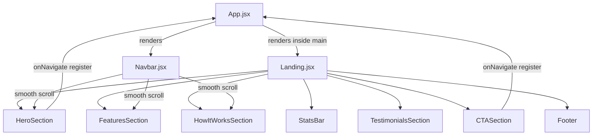
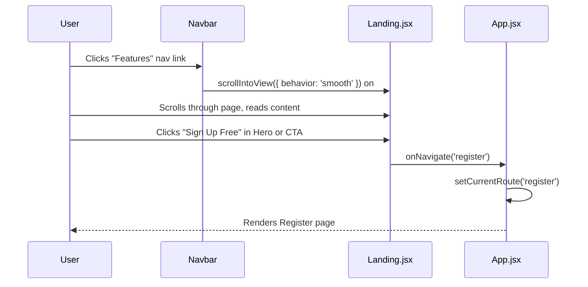
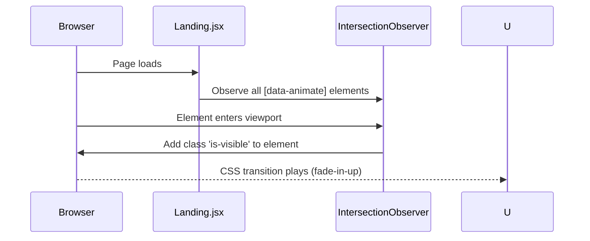

# Design Document: Landing Page Redesign

## Overview

LinkUp's landing page is the first impression for every prospective user — Azerbaijani university students looking for professional connections. The current page is functional but lacks the visual polish and conversion-focused structure of world-class SaaS landing pages (Linear, Vercel, Notion). This redesign elevates the page to a premium, animated, multi-section experience that communicates trust, value, and momentum while staying fully within the existing tech stack (React + Vite, Tailwind CSS v4, `@iconify/react`, `react-i18next`) and the custom `onNavigate` routing system.

The redesign introduces seven distinct sections: a sticky Navbar (already handled by `Navbar.jsx`), an animated Hero, a Stats Bar, a premium Features grid, a visual How It Works timeline, a Testimonials section with mock data, a final CTA block, and an enriched Footer. All text is i18n-ready with new translation keys added to all four locale files (`az`, `en`, `ru`, `tr`). All animations are CSS-only, added to `src/index.css`, keeping the bundle lean.

---

## Architecture

The landing page is a single React component (`src/pages/Landing.jsx`) rendered by `App.jsx` when no user is authenticated. It receives one prop — `onNavigate` — and uses `useTranslation` for all copy. The Navbar is rendered by `App.jsx` above the `<main>` wrapper, so the landing page itself only needs to handle scroll targets (`id="features"`, `id="how"`, `id="testimonials"`).



---

## Sequence Diagrams

### User Scroll & CTA Flow



### Intersection Observer Animation Flow



---

## Components and Interfaces

### Landing.jsx (root component)

**Purpose**: Orchestrates all sections, owns no state beyond scroll refs.

**Interface**:
```typescript
interface LandingProps {
  onNavigate: (route: string, params?: object, clearHistory?: boolean) => void
}
```

**Responsibilities**:
- Render all seven sections in order
- Pass `onNavigate` down to Hero and CTA sections
- Initialize `IntersectionObserver` via a `useEffect` to trigger scroll animations

---

### HeroSection

**Purpose**: Full-viewport opening section with animated headline, subtext, dual CTAs, and floating UI mockup.

**Interface**:
```typescript
interface HeroSectionProps {
  onNavigate: (route: string) => void
}
```

**Visual Design**:
- Background: `#050505` with `bg-grid-pattern`
- Two radial glow blobs (indigo top-left, purple bottom-right) with slow CSS pulse animation
- Badge pill at top: `landing.badge`
- H1: Two lines — plain white + `gradient-text` (indigo → purple → cyan)
- Subtext: `text-neutral-400`, max-width constrained
- Two CTA buttons: `btn-secondary` (rounded-full, "Sign Up Free") + `btn-outline` (rounded-full, "Explore Platform")
- Floating "app preview" card: a `glass-card` mockup showing a mini profile card with avatar, name, skill badges — purely decorative, built with Tailwind, no images needed
- Animated entrance: headline and buttons use `anim-up` with staggered `animation-delay`

---

### StatsBar

**Purpose**: Horizontal strip of three key metrics to establish social proof immediately below the hero.

**Interface**: No props (reads translation keys directly).

**Visual Design**:
- Full-width strip with subtle top/bottom border (`border-white/5`)
- Three stats in a row: `2.4K+ Users`, `180+ Projects`, `35+ Universities`
- Each stat: large bold number with `gradient-text`, small label in `text-neutral-500`
- On mobile: wraps to a 3-column grid
- Animated count-up effect via CSS `@keyframes` on the number (optional enhancement)

---

### FeaturesSection

**Purpose**: Six feature cards in a premium grid layout with hover effects and icon accents.

**Interface**: No props.

**Visual Design**:
- Section badge + heading: `{t('landing.whyLinkUpPrefix')} LinkUp?`
- Grid: `lg:grid-cols-3 md:grid-cols-2` with `gap-6`
- Each `FeatureCard`:
  - `glass-card` base with `bg-[#080808]`
  - Colored icon container (existing color system: brand/purple/cyan/emerald/amber/rose)
  - On hover: border brightens (`hover:border-white/20`), card lifts (`hover:-translate-y-1`), subtle glow shadow appears
  - Icon animates on hover: slight scale-up (`hover:scale-110`)
  - Title + description text
- Cards animate in with staggered `is-visible` scroll trigger

---

### HowItWorksSection

**Purpose**: Five-step visual flow showing the user journey from registration to project creation.

**Interface**: No props.

**Visual Design**:
- Section badge + heading
- Desktop: horizontal timeline — five step nodes connected by a dashed gradient line
  - Each node: numbered circle (colored per step), title below, short description
  - Connector line: `border-dashed border-white/10` with a gradient overlay
- Mobile: vertical stacked list with left-side colored line
- Step nodes animate in sequentially via staggered `animation-delay` on `is-visible`

**Layout**:
```
[1 Register] ------- [2 Profile] ------- [3 Discover] ------- [4 Connect] ------- [5 Create]
```

---

### TestimonialsSection

**Purpose**: Social proof via three mock testimonial cards from fictional Azerbaijani university students.

**Interface**: No props (uses hardcoded mock data with i18n keys for quotes).

**Mock Data Structure**:
```typescript
interface Testimonial {
  nameKey: string        // i18n key for name
  roleKey: string        // i18n key for role/university
  quoteKey: string       // i18n key for quote text
  avatarGradient: string // Tailwind gradient classes for avatar
  initials: string       // Two-letter initials
  rating: number         // 1-5 stars (all 5 for mock data)
}
```

**Visual Design**:
- Section heading: `{t('landing.testimonialsTitle')}`
- Three cards in a row (`lg:grid-cols-3`), stacked on mobile
- Each card: `glass-card`, `bg-[#080808]`, rounded-2xl
  - Top: avatar (gradient circle with initials, matching existing profile avatar style), name, role
  - Five gold stars (`text-amber-400`)
  - Quote text in `text-neutral-300`
- Subtle horizontal scroll on mobile (overflow-x-auto with snap)

---

### CTASection

**Purpose**: Final conversion section with a prominent call-to-action.

**Interface**:
```typescript
interface CTASectionProps {
  onNavigate: (route: string) => void
}
```

**Visual Design**:
- Rounded card (`rounded-[2rem]`) with `bg-[#0A0A0A]` and `border border-white/5`
- Centered radial glow (indigo) behind the text
- Large heading: `{t('landing.readyJoin')}` + `gradient-text` highlight
- Subtext + single `btn-primary` CTA button (rounded-full)
- Subtle animated particle dots in the background (CSS-only, `@keyframes float`)

---

### Footer

**Purpose**: Enriched footer with logo, navigation links, social links, and copyright.

**Interface**: No props.

**Visual Design**:
- `border-t border-white/5`
- Three-column layout on desktop, stacked on mobile:
  - **Left**: Logo + tagline (`{t('landing.footerTagline')}`)
  - **Center**: Quick links — Features, How It Works, Sign Up (smooth scroll or navigate)
  - **Right**: Social icons (GitHub, LinkedIn, Instagram) as icon buttons
- Bottom bar: copyright text (`{t('landing.footer')}`) + flag emoji

---

## Data Models

### Translation Keys (New — to be added to all 4 locale files)

```typescript
interface NewLandingTranslationKeys {
  // Testimonials section
  "landing.testimonialsTitle": string        // "What students say"
  "landing.testimonials.t1.name": string     // "Aytən Həsənova"
  "landing.testimonials.t1.role": string     // "Computer Science, BDU"
  "landing.testimonials.t1.quote": string    // Full quote text
  "landing.testimonials.t2.name": string     // "Rauf Əliyev"
  "landing.testimonials.t2.role": string     // "Design, ADA University"
  "landing.testimonials.t2.quote": string
  "landing.testimonials.t3.name": string     // "Nigar Quliyeva"
  "landing.testimonials.t3.role": string     // "Marketing, UNEC"
  "landing.testimonials.t3.quote": string

  // Footer
  "landing.footerTagline": string            // "Azerbaijan's professional network for students"
  "landing.footerLinks": string              // "Links" (column heading)
  "landing.footerSocial": string             // "Follow Us"

  // Stats bar (labels already exist: users, projects, universities)
  // No new keys needed for stats

  // How It Works — connector aria label
  "landing.stepsTitle": string               // "How it works, step by step"
}
```

### Existing Keys (must be preserved, no changes)

All keys under `landing.badge`, `landing.heroTitle1/2`, `landing.heroDesc`, `landing.freeRegister`, `landing.exploreBtn`, `landing.users`, `landing.projects`, `landing.universities`, `landing.whyLinkUpPrefix`, `landing.notJustSocial`, `landing.howItWorksPrefix`, `landing.howItWorksSuffix`, `landing.readyJoin`, `landing.readyJoinHighlight`, `landing.readyDesc`, `landing.registerNow`, `landing.footer`, `landing.features.*`, `landing.steps.*` remain unchanged.

---

## Algorithmic Pseudocode

### Scroll Animation System

```pascal
PROCEDURE initScrollAnimations()
  INPUT: none
  OUTPUT: side effect — elements animate when entering viewport

  SEQUENCE
    elements ← document.querySelectorAll('[data-animate]')
    
    observer ← new IntersectionObserver(
      PROCEDURE(entries)
        FOR each entry IN entries DO
          IF entry.isIntersecting THEN
            entry.target.classList.add('is-visible')
            observer.unobserve(entry.target)  // animate once only
          END IF
        END FOR
      END PROCEDURE,
      { threshold: 0.15, rootMargin: '0px 0px -50px 0px' }
    )
    
    FOR each element IN elements DO
      observer.observe(element)
    END FOR
    
    RETURN observer  // for cleanup in useEffect return
  END SEQUENCE
END PROCEDURE
```

**Preconditions**:
- DOM is mounted (called inside `useEffect`)
- Elements with `data-animate` attribute exist in the rendered tree

**Postconditions**:
- Each observed element receives `is-visible` class exactly once when it enters the viewport
- Observer is returned for cleanup on component unmount

**Loop Invariants**:
- All previously processed entries have had `is-visible` applied if they were intersecting
- Observer state remains consistent throughout iteration

---

### Smooth Scroll Handler

```pascal
PROCEDURE scrollToSection(sectionId)
  INPUT: sectionId of type String
  OUTPUT: side effect — browser scrolls to element

  SEQUENCE
    element ← document.getElementById(sectionId)
    
    IF element IS NOT NULL THEN
      element.scrollIntoView({ behavior: 'smooth', block: 'start' })
    END IF
  END SEQUENCE
END PROCEDURE
```

**Preconditions**:
- `sectionId` is a non-empty string
- The element may or may not exist in the DOM

**Postconditions**:
- If element exists: browser initiates smooth scroll to that element
- If element does not exist: no action taken, no error thrown

---

### Testimonials Data Builder

```pascal
FUNCTION buildTestimonials(t)
  INPUT: t — i18n translation function
  OUTPUT: Array of Testimonial objects

  SEQUENCE
    testimonials ← [
      {
        nameKey:        t('landing.testimonials.t1.name'),
        roleKey:        t('landing.testimonials.t1.role'),
        quoteKey:       t('landing.testimonials.t1.quote'),
        avatarGradient: 'from-brand-500 to-purple-500',
        initials:       'AH',
        rating:         5
      },
      {
        nameKey:        t('landing.testimonials.t2.name'),
        roleKey:        t('landing.testimonials.t2.role'),
        quoteKey:       t('landing.testimonials.t2.quote'),
        avatarGradient: 'from-cyan-500 to-emerald-500',
        initials:       'RƏ',
        rating:         5
      },
      {
        nameKey:        t('landing.testimonials.t3.name'),
        roleKey:        t('landing.testimonials.t3.role'),
        quoteKey:       t('landing.testimonials.t3.quote'),
        avatarGradient: 'from-amber-500 to-rose-500',
        initials:       'NQ',
        rating:         5
      }
    ]
    
    RETURN testimonials
  END SEQUENCE
END FUNCTION
```

**Preconditions**:
- `t` is a valid i18n translation function
- All referenced translation keys exist in the locale files

**Postconditions**:
- Returns an array of exactly 3 Testimonial objects
- All string fields are non-empty (assuming locale files are complete)

---

## Key Functions with Formal Specifications

### Landing Component (root)

```typescript
function Landing({ onNavigate }: LandingProps): JSX.Element
```

**Preconditions**:
- `onNavigate` is a function with signature `(route: string, params?: object) => void`

**Postconditions**:
- Returns a valid JSX tree containing all seven sections
- `useEffect` registers `IntersectionObserver` and returns cleanup function
- No direct DOM mutations outside of `IntersectionObserver` callback

---

### FeatureCard

```typescript
function FeatureCard({ icon, color, title, desc }: FeatureCardProps): JSX.Element
```

**Preconditions**:
- `icon` is a valid Iconify icon string
- `color` is one of: `'brand' | 'purple' | 'cyan' | 'emerald' | 'amber' | 'rose'`
- `title` and `desc` are non-empty strings

**Postconditions**:
- Renders a card with correct color variant applied
- Falls back to `brand` color if `color` is unrecognized

---

### StepNode (How It Works)

```typescript
function StepNode({ number, color, title, desc, isLast }: StepNodeProps): JSX.Element
```

**Preconditions**:
- `number` is a string `'1'` through `'5'`
- `isLast` controls whether the connector line is rendered

**Postconditions**:
- Renders step circle, title, description
- Renders connector line only when `isLast === false`

---

### TestimonialCard

```typescript
function TestimonialCard({ name, role, quote, avatarGradient, initials, rating }: TestimonialCardProps): JSX.Element
```

**Preconditions**:
- `rating` is an integer between 1 and 5
- `initials` is a 1-2 character string

**Postconditions**:
- Renders exactly `rating` filled star icons
- Avatar gradient is applied via Tailwind classes

---

## Example Usage

```jsx
// App.jsx — no changes needed, Landing already receives onNavigate
<Landing onNavigate={handleNavigate} />

// Inside Landing.jsx — Hero CTA
<button
  onClick={() => onNavigate('register')}
  className="btn-secondary rounded-full flex items-center gap-2 px-8 py-3.5 text-sm font-semibold"
>
  <Icon icon="mdi:account-plus-outline" className="text-lg" />
  {t('landing.freeRegister')}
</button>

// Scroll animation trigger
<div data-animate className="opacity-0 translate-y-5 transition-all duration-700 ease-out">
  {/* section content */}
</div>

// CSS class applied by IntersectionObserver
// .is-visible { opacity: 1 !important; transform: translateY(0) !important; }

// Testimonial card usage
{buildTestimonials(t).map((item, i) => (
  <TestimonialCard key={i} {...item} />
))}
```

---

## Correctness Properties

*A property is a characteristic or behavior that should hold true across all valid executions of a system — essentially, a formal statement about what the system should do. Properties serve as the bridge between human-readable specifications and machine-verifiable correctness guarantees.*

### Property 1: Navigation integrity

*For any* CTA button click event on the landing page, `onNavigate` is called with `'register'` as the first argument — never with an undefined or null route.

**Validates: Requirements 2.2, 7.2, 12.2**

### Property 2: Scroll safety

*For any* section id string passed to the scroll handler, the function either scrolls to the element if it exists or silently does nothing — it never throws an error regardless of whether the element is present in the DOM.

**Validates: Requirements 1.6**

### Property 3: Animation idempotency

*For any* element with the `data-animate` attribute, the `IntersectionObserver` adds the `is-visible` class exactly once — calling `unobserve` immediately after — so the entrance animation triggers exactly once regardless of scroll direction or repeated viewport entries.

**Validates: Requirements 9.2, 9.3**

### Property 4: Color variant safety

*For any* string value passed as the `color` prop to `FeatureCard`, the component always resolves to a valid color style object and renders without throwing; an unrecognized color falls back to the `brand` variant.

**Validates: Requirements 4.3, 4.4**

### Property 5: FeatureCard rendering completeness

*For any* valid combination of `icon`, `title`, and `desc` prop values, `FeatureCard` renders all three values in its output without omitting or corrupting any of them.

**Validates: Requirements 4.5**

### Property 6: Star rating accuracy

*For any* integer `rating` value between 1 and 5 passed to `TestimonialCard`, the component renders exactly `rating` filled star icon elements — no more, no fewer.

**Validates: Requirements 6.3**

### Property 7: i18n key completeness

*For any* of the four supported locale codes (`az`, `en`, `ru`, `tr`), every required `landing.*` translation key resolves to a non-empty string — no key is missing or blank in any locale.

**Validates: Requirements 11.3**

### Property 8: Existing key preservation

*For any* existing `landing.*` translation key present before the redesign, that key continues to exist with its original value after locale file updates — no existing key is removed or renamed.

**Validates: Requirements 11.4**

---

## Error Handling

### Missing Translation Key

**Condition**: A translation key is missing from one locale file.
**Response**: `react-i18next` falls back to the key string itself (e.g., `"landing.testimonialsTitle"`), which is visible but not broken.
**Recovery**: Add the missing key to the locale file. No code change needed.

### IntersectionObserver Not Supported

**Condition**: Very old browser without `IntersectionObserver` support.
**Response**: Elements remain in their initial CSS state (`opacity-0 translate-y-5`), making content invisible.
**Recovery**: Add a feature detection guard in `useEffect`:
```javascript
if (!('IntersectionObserver' in window)) {
  document.querySelectorAll('[data-animate]').forEach(el => el.classList.add('is-visible'));
  return;
}
```

### `onNavigate` Not Provided

**Condition**: `Landing` is rendered without the `onNavigate` prop.
**Response**: Clicking CTA buttons throws a TypeError.
**Recovery**: Prop is always provided by `App.jsx`; add PropTypes or TypeScript interface as documentation guard.

### Scroll Target Not Found

**Condition**: `document.getElementById('features')` returns `null` (e.g., during SSR or if section is conditionally removed).
**Response**: `scrollIntoView` is not called; no error thrown (null-guarded).
**Recovery**: Ensure all scroll target sections are always rendered unconditionally.

---

## Testing Strategy

### Unit Testing Approach

Test each sub-component in isolation using Vitest + React Testing Library (already configured in the project):

- `FeatureCard`: renders correct icon, title, desc; applies correct color class for each variant; falls back to `brand` for unknown color.
- `StepNode`: renders connector line when `isLast=false`; omits it when `isLast=true`.
- `TestimonialCard`: renders correct number of stars for `rating` prop; displays initials in avatar.
- `Landing`: renders all seven sections; CTA buttons call `onNavigate('register')`; scroll buttons call `scrollIntoView`.

### Property-Based Testing Approach

**Property Test Library**: `fast-check` (already used in the project per existing test files)

Key properties to test:

1. **Color variant safety**: For any string input as `color` prop, `FeatureCard` never throws and always renders a valid className string.
2. **Rating bounds**: For any integer `rating` between 1 and 5, `TestimonialCard` renders exactly `rating` star elements.
3. **Translation key coverage**: For any of the four locale codes, all required landing keys resolve to non-empty strings.

### Integration Testing Approach

- Render `Landing` inside a mock `App` context with a spy on `onNavigate`; verify clicking "Sign Up Free" triggers `onNavigate('register')`.
- Verify smooth scroll calls are made with correct section IDs when Navbar links are clicked.
- Verify `IntersectionObserver` cleanup is called on component unmount.

---

## Performance Considerations

- **No external images**: The hero "app preview" mockup is built entirely with Tailwind/CSS — zero image requests.
- **CSS-only animations**: All entrance animations use CSS `transition` and `@keyframes` — no JavaScript animation libraries.
- **IntersectionObserver cleanup**: The observer is disconnected in the `useEffect` cleanup function to prevent memory leaks.
- **Lazy section rendering**: All sections are rendered immediately (no lazy loading needed — the page is a single scroll experience and content is lightweight).
- **Icon bundle**: `@iconify/react` loads icons on-demand; no additional bundle cost for new icons used.
- **Translation files**: New keys add ~30 lines per locale file — negligible impact on load time.

---

## Security Considerations

- **No user input on landing page**: The landing page is entirely read-only; no forms, no XSS vectors.
- **External links in Footer**: Social links (GitHub, LinkedIn, Instagram) must use `target="_blank" rel="noopener noreferrer"` to prevent tab-napping.
- **Mock testimonial data**: Testimonial names and quotes are i18n strings — no dynamic user data is rendered, eliminating any injection risk.

---

## CSS Additions to `src/index.css`

New keyframes and utility classes to add:

```css
/* Scroll-triggered animation base state */
[data-animate] {
  opacity: 0;
  transform: translateY(20px);
  transition: opacity 0.6s ease-out, transform 0.6s ease-out;
}

[data-animate].is-visible {
  opacity: 1;
  transform: translateY(0);
}

/* Staggered animation delays for grid children */
[data-animate-delay="1"] { transition-delay: 0.1s; }
[data-animate-delay="2"] { transition-delay: 0.2s; }
[data-animate-delay="3"] { transition-delay: 0.3s; }
[data-animate-delay="4"] { transition-delay: 0.4s; }
[data-animate-delay="5"] { transition-delay: 0.5s; }

/* Slow pulse for hero background glows */
@keyframes pulse-slow {
  0%, 100% { opacity: 0.6; transform: scale(1); }
  50%       { opacity: 1;   transform: scale(1.08); }
}
.animate-pulse-slow {
  animation: pulse-slow 6s ease-in-out infinite;
}

/* Float animation for CTA section decorative dots */
@keyframes float {
  0%, 100% { transform: translateY(0px); }
  50%       { transform: translateY(-12px); }
}
.animate-float {
  animation: float 4s ease-in-out infinite;
}

/* Shimmer effect for stats numbers */
@keyframes shimmer {
  0%   { background-position: -200% center; }
  100% { background-position:  200% center; }
}
.gradient-text-animated {
  background: linear-gradient(90deg, #818cf8, #c084fc, #38bdf8, #818cf8);
  background-size: 200% auto;
  -webkit-background-clip: text;
  -webkit-text-fill-color: transparent;
  background-clip: text;
  animation: shimmer 4s linear infinite;
}

/* Timeline connector line */
.timeline-connector {
  flex: 1;
  height: 1px;
  background: linear-gradient(to right, rgba(99,102,241,0.3), rgba(192,132,252,0.3));
  border-top: 1px dashed rgba(255,255,255,0.1);
  margin-top: -20px; /* align with center of step circles */
}
```

---

## Dependencies

All dependencies are already installed. No new packages required.

| Dependency | Version | Usage |
|---|---|---|
| `react` | existing | Component framework |
| `@iconify/react` | existing | All icons |
| `react-i18next` | existing | All text strings |
| `tailwindcss` v4 | existing | All styling |
| `IntersectionObserver` | Web API | Scroll animations (built-in browser API) |

---

## Section Layout Summary

```
┌─────────────────────────────────────────────────────────┐
│  NAVBAR (Navbar.jsx — sticky, glass, scroll links)      │
├─────────────────────────────────────────────────────────┤
│  HERO                                                   │
│  Badge → H1 (white + gradient) → Subtext → 2 CTAs      │
│  Floating app preview card (right side, desktop)        │
├─────────────────────────────────────────────────────────┤
│  STATS BAR                                              │
│  2.4K+ Users  |  180+ Projects  |  35+ Universities     │
├─────────────────────────────────────────────────────────┤
│  FEATURES  (#features)                                  │
│  Badge → Heading → 3×2 grid of FeatureCards             │
├─────────────────────────────────────────────────────────┤
│  HOW IT WORKS  (#how)                                   │
│  Badge → Heading → 5-step horizontal timeline           │
├─────────────────────────────────────────────────────────┤
│  TESTIMONIALS  (#testimonials)                          │
│  Heading → 3 TestimonialCards                           │
├─────────────────────────────────────────────────────────┤
│  CTA                                                    │
│  Large heading → Subtext → "Register Now" button        │
├─────────────────────────────────────────────────────────┤
│  FOOTER                                                 │
│  Logo + tagline | Quick links | Social icons            │
│  Copyright bar                                          │
└─────────────────────────────────────────────────────────┘
```
