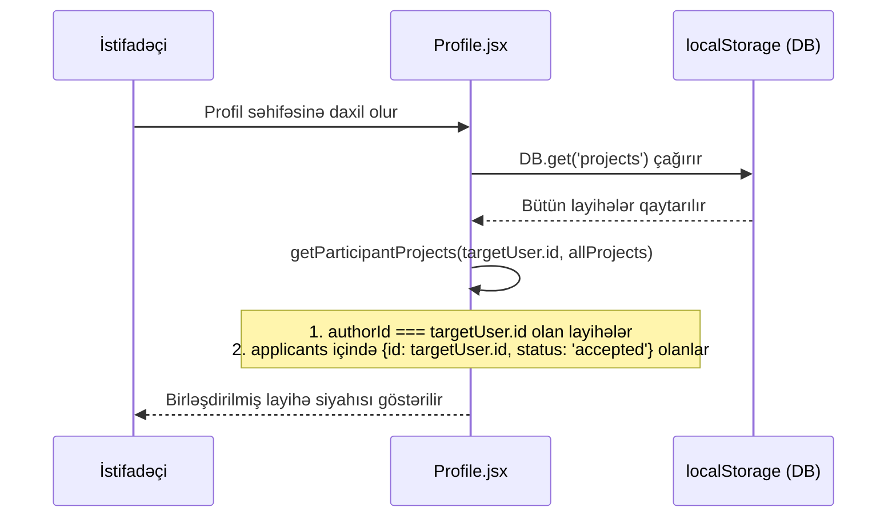
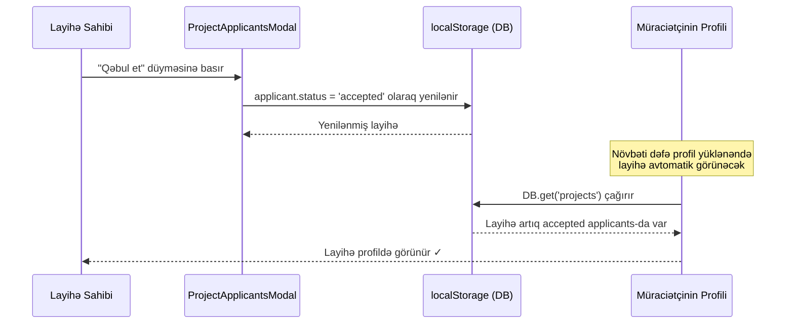

# Design Document: Participant Project Visibility

## Overview

Hazırda istifadəçinin profil səhifəsindəki "Layihələr" tabı yalnız həmin istifadəçinin yaratdığı layihələri göstərir. Bu xüsusiyyət, qəbul edilmiş müraciətçilərin (accepted applicants) və birbaşa əlavə edilmiş üzvlərin (added members) profilindəki "Layihələr" tabında iştirak etdikləri layihələri də göstərəcək. Beləliklə, bir istifadəçinin profili onun həm yaratdığı, həm də iştirak etdiyi bütün layihələri əks etdirəcək.

Bu dəyişiklik `Messages.jsx`-dəki mövcud məntiqlə uyğundur — orada qrup söhbətləri üçün həm layihə sahibi, həm də `accepted` statuslu iştirakçılar nəzərə alınır. Eyni məntiqi `Profile.jsx`-ə tətbiq etmək kifayətdir.

---

## Architecture

```mermaid
graph TD
    A[Profile.jsx] --> B{userProjects hesablanması}
    B --> C[Yaradılan layihələr\nauhorId === targetUser.id]
    B --> D[İştirak edilən layihələr\napplicants içində accepted status]
    C --> E[Birləşdirilmiş layihə siyahısı]
    D --> E
    E --> F[UI: Layihələr Tabı]

    subgraph DB [localStorage - DB]
        G[(projects)]
    end

    B --> G
    G --> B

    subgraph Mövcud Məntiq [Messages.jsx - Mövcud Məntiq]
        H[myProjects = authorId === me\nOR accepted applicant]
    end

    style Mövcud Məntiq fill:#1a2a1a,stroke:#22c55e,color:#86efac
    style DB fill:#1a1a2e,stroke:#6366f1,color:#a5b4fc
```

---

## Sequence Diagrams

### Profil Səhifəsi Yüklənməsi (Yeni Məntiq)



### Müraciətin Qəbul Edilməsi (Mövcud Axın - Dəyişmir)



---

## Components and Interfaces

### Component 1: Profile.jsx — `getParticipantProjects` Funksiyası

**Məqsəd**: Bir istifadəçinin həm yaratdığı, həm də iştirak etdiyi layihələri qaytarır.

**İnterfeys**:

```typescript
interface Applicant {
  id: string;
  status: 'pending' | 'accepted' | 'rejected' | 'left';
}

interface Project {
  id: string;
  title: string;
  desc: string;
  authorId: string;
  applicants: Applicant[];
  status: 'active' | 'completed';
  grad: string;
  createdAt: number;
  skills: string[];
  projectType?: string;
  stage?: string;
}

function getParticipantProjects(userId: string, allProjects: Project[]): Project[]
```

**Məsuliyyətlər**:
- `authorId === userId` olan layihələri seçir (yaradılan layihələr)
- `applicants` massivindəki `{ id: userId, status: 'accepted' }` girişlərini tapır (iştirak edilən layihələr)
- Köhnə format dəstəyi: `applicants` massivindəki sadə string ID-ləri də nəzərə alır
- Dublikatları aradan qaldırır (bir istifadəçi həm sahibi, həm də applicant ola bilər — nəzəri olaraq)
- Nəticəni `createdAt` üzrə azalan sırada qaytarır

**Vizual Fərqləndirmə**:
- Yaradılan layihələr: mövcud UI (redaktə/silmə düymələri görünür)
- İştirak edilən layihələr: yeni badge — "İştirakçı" etiketi, redaktə/silmə düymələri gizlənir

---

### Component 2: Profile.jsx — Layihə Kartı UI

**Məqsəd**: Layihə kartında istifadəçinin rolu (sahibi vs iştirakçı) göstərilir.

**İnterfeys**:

```typescript
interface ProjectCardProps {
  project: Project;
  isOwner: boolean;        // authorId === currentUser.id
  isParticipant: boolean;  // accepted applicant, not owner
  onNavigate: Function;
  onEdit?: Function;       // yalnız isOwner === true olduqda
  onDelete?: Function;     // yalnız isOwner === true olduqda
  onToggleStatus?: Function; // yalnız isOwner === true olduqda
}
```

**Məsuliyyətlər**:
- `isOwner === true` olduqda: redaktə, silmə, status dəyişmə düymələri göstərilir
- `isParticipant === true` olduqda: "İştirakçı" badge-i göstərilir, idarəetmə düymələri gizlənir
- Hər iki halda: layihə başlığı, təsviri, bacarıqlar, status göstərilir

---

## Data Models

### Mövcud: Project Obyekti

```typescript
interface Project {
  id: string;                    // 'p_' + uid()
  title: string;                 // Layihə adı
  desc: string;                  // Təsvir
  authorId: string;              // Yaradan istifadəçinin ID-si
  applicants: (Applicant | string)[]; // Müraciətçilər (köhnə: string[], yeni: Applicant[])
  status: 'active' | 'completed';
  grad: string;                  // Gradient CSS class
  createdAt: number;             // Unix timestamp
  skills: string[];              // Tələb olunan bacarıqlar
  projectType?: string;          // 'Startap', 'Açıq Mənbə', ...
  stage?: string;                // 'Yalnız İdeya', 'MVP Hazırdır', ...
  documentUrl?: string;
  documentFile?: { name: string; type: string; data: string };
}

interface Applicant {
  id: string;
  status: 'pending' | 'accepted' | 'rejected' | 'left';
}
```

**Qeyd**: Yeni data modeli tələb olunmur. Mövcud `applicants[].status === 'accepted'` sahəsi bu xüsusiyyəti dəstəkləmək üçün kifayətdir.

---

## Algorithmic Pseudocode

### Əsas Alqoritm: getParticipantProjects

```pascal
FUNCTION getParticipantProjects(userId, allProjects)
  INPUT: userId: String, allProjects: Project[]
  OUTPUT: participantProjects: Project[]

  PRECONDITIONS:
    - userId is non-empty string
    - allProjects is a valid array (may be empty)

  POSTCONDITIONS:
    - Returns all projects where user is author OR accepted applicant
    - No duplicate projects in result
    - Result sorted by createdAt descending

  BEGIN
    result ← []

    FOR EACH project IN allProjects DO
      // Check 1: User is the author
      IF project.authorId = userId THEN
        result.append(project)
        CONTINUE
      END IF

      // Check 2: User is an accepted applicant
      FOR EACH applicant IN project.applicants DO
        // Handle both old format (string) and new format (object)
        IF typeof(applicant) = 'string' THEN
          applicantId ← applicant
          applicantStatus ← 'pending'  // old format has no status
        ELSE
          applicantId ← applicant.id
          applicantStatus ← applicant.status
        END IF

        IF applicantId = userId AND applicantStatus = 'accepted' THEN
          result.append(project)
          BREAK  // No need to check other applicants
        END IF
      END FOR
    END FOR

    // Sort by createdAt descending (newest first)
    result.sort(BY createdAt DESCENDING)

    RETURN result
  END

  LOOP INVARIANT (outer FOR):
    - All projects processed so far have been correctly classified
    - result contains no duplicates

  LOOP INVARIANT (inner FOR):
    - All applicants checked so far for current project
    - If accepted applicant found, project already added to result
```

### Alqoritm: isProjectOwner

```pascal
FUNCTION isProjectOwner(project, userId)
  INPUT: project: Project, userId: String
  OUTPUT: Boolean

  PRECONDITIONS:
    - project is non-null
    - userId is non-empty string

  POSTCONDITIONS:
    - Returns true if and only if project.authorId === userId

  BEGIN
    RETURN project.authorId = userId
  END
```

### Alqoritm: isProjectParticipant

```pascal
FUNCTION isProjectParticipant(project, userId)
  INPUT: project: Project, userId: String
  OUTPUT: Boolean

  PRECONDITIONS:
    - project is non-null
    - userId is non-empty string

  POSTCONDITIONS:
    - Returns true if user is accepted applicant AND not the author
    - Returns false if user is the author (even if also in applicants)

  BEGIN
    IF project.authorId = userId THEN
      RETURN false  // Author is not a "participant" in this context
    END IF

    FOR EACH applicant IN (project.applicants OR []) DO
      IF typeof(applicant) = 'string' THEN
        CONTINUE  // Old format: no status, skip
      END IF

      IF applicant.id = userId AND applicant.status = 'accepted' THEN
        RETURN true
      END IF
    END FOR

    RETURN false
  END
```

---

## Key Functions with Formal Specifications

### `getParticipantProjects(userId, allProjects)`

**Preconditions:**
- `userId` boş olmayan string-dir
- `allProjects` etibarlı massivdir (boş ola bilər)

**Postconditions:**
- Nəticə yalnız `authorId === userId` olan layihələri ehtiva edir
- Nəticə yalnız `applicants` içində `{ id: userId, status: 'accepted' }` olan layihələri ehtiva edir
- Nəticədə dublikat yoxdur
- Nəticə `createdAt` üzrə azalan sırada sıralanıb

**Loop Invariants:**
- Xarici döngü: işlənmiş bütün layihələr düzgün təsnif edilib
- Daxili döngü: cari layihə üçün bütün applicant-lar yoxlanılıb

---

### `isProjectParticipant(project, userId)`

**Preconditions:**
- `project` null deyil
- `userId` boş olmayan string-dir

**Postconditions:**
- `true` qaytarır ↔ `project.authorId !== userId` VƏ `applicants` içində `{ id: userId, status: 'accepted' }` var
- `false` qaytarır ↔ istifadəçi sahibdir VƏ ya accepted applicant deyil

---

## Example Usage

```javascript
// Profile.jsx-dəki useEffect içərisində
useEffect(() => {
  if (!targetUser) return;

  const allProjects = DB.get('projects');

  // YENİ: Həm yaradılan, həm iştirak edilən layihələr
  const participantProjects = allProjects.filter(p => {
    // Yaradılan layihə
    if (p.authorId === targetUser.id) return true;

    // İştirak edilən layihə (accepted applicant)
    return (p.applicants || []).some(a => {
      const aId = typeof a === 'object' ? a.id : a;
      const aStatus = typeof a === 'object' ? a.status : 'pending';
      return aId === targetUser.id && aStatus === 'accepted';
    });
  });

  setUserProjects(participantProjects);
}, [targetUser?.id, tab]);

// Layihə kartında rol müəyyənləşdirmə
const isOwner = (project) => project.authorId === targetUser.id;

const isParticipant = (project) =>
  !isOwner(project) &&
  (project.applicants || []).some(a => {
    const aId = typeof a === 'object' ? a.id : a;
    const aStatus = typeof a === 'object' ? a.status : 'pending';
    return aId === targetUser.id && aStatus === 'accepted';
  });

// UI-da şərti render
{isOwner(project) && (
  <OwnerControls project={project} />
)}
{isParticipant(project) && (
  <ParticipantBadge />
)}
```

---

## Correctness Properties

*A property is a characteristic or behavior that should hold true across all valid executions of a system — essentially, a formal statement about what the system should do. Properties serve as the bridge between human-readable specifications and machine-verifiable correctness guarantees.*

### Property 1: Ownership Inclusion

*For any* user ID and any list of projects, `getParticipantProjects` SHALL include every project where `project.authorId === userId` in the returned result.

**Validates: Requirements 1.1, 4.1, 6.1**

---

### Property 2: Accepted Applicant Inclusion

*For any* user ID and any list of projects, `getParticipantProjects` SHALL include every project where the `applicants` array contains an object entry with `id === userId` and `status === 'accepted'`.

**Validates: Requirements 1.2, 4.2, 6.2**

---

### Property 3: Non-Accepted Statuses Are Excluded

*For any* user ID and any project where the user appears in `applicants` with a status of `'pending'`, `'rejected'`, or `'left'` (and is not the `authorId`), `getParticipantProjects` SHALL NOT include that project in the returned result.

**Validates: Requirements 1.3, 1.4, 1.5**

---

### Property 4: No Duplicate Projects

*For any* user ID and any list of projects (including cases where the user is both `authorId` and an `accepted` applicant of the same project), `getParticipantProjects` SHALL return a list where each project appears at most once.

**Validates: Requirements 3.1, 4.5**

---

### Property 5: Sort Order Invariant

*For any* user ID and any list of projects, the result returned by `getParticipantProjects` SHALL be sorted by `createdAt` in descending order — i.e., for every adjacent pair of projects in the result, the earlier project's `createdAt` SHALL be greater than or equal to the later project's `createdAt`.

**Validates: Requirements 1.6, 4.6**

---

### Property 6: Legacy Format Exclusion

*For any* user ID and any project whose `applicants` array contains only plain string entries (Legacy_Format), `getParticipantProjects` SHALL NOT include that project in the result based on those string entries alone (unless the user is the `authorId`).

**Validates: Requirements 5.1, 5.2, 4.4**

---

### Property 7: Participant Controls Are Hidden

*For any* project where `isProjectParticipant(project, userId)` returns `true`, the rendered project card SHALL NOT contain edit, delete, or status-toggle controls.

**Validates: Requirements 2.3**

---

### Property 8: Project Card Contains Required Fields

*For any* project card rendered in the Projects_Tab (whether for a Project_Owner or a Participant), the rendered output SHALL contain the project's title, description, skills list, and status.

**Validates: Requirements 2.4**

---

## Error Handling

### Xəta Ssenarisi 1: Boş applicants massivi

**Şərt**: `project.applicants` `undefined` və ya `null`-dur
**Cavab**: `(project.applicants || [])` ilə default boş massiv istifadə edilir
**Bərpa**: Xəta baş vermir, layihə yalnız `authorId` yoxlaması ilə qiymətləndirilir

### Xəta Ssenarisi 2: Köhnə format applicant (sadə string)

**Şərt**: `applicants` massivindəki element `string` tipindədir (köhnə format)
**Cavab**: `typeof a === 'object'` yoxlaması ilə aşkarlanır, `status` `'pending'` kimi qəbul edilir
**Bərpa**: Bu applicant `accepted` sayılmır, layihə iştirakçı kimi göstərilmir

### Xəta Ssenarisi 3: targetUser null

**Şərt**: `targetUser` hələ yüklənməyib
**Cavab**: `useEffect`-in əvvəlindəki `if (!targetUser) return;` yoxlaması
**Bərpa**: Effekt icra edilmir, boş vəziyyət qalır

### Xəta Ssenarisi 4: Silinmiş layihə

**Şərt**: Layihə DB-dən silinib, lakin applicant-ın profili hələ yüklüdür
**Cavab**: `DB.get('projects')` hər dəfə `useEffect` işləyəndə yenidən oxunur
**Bərpa**: Silinmiş layihə avtomatik olaraq siyahıdan çıxır

---

## Testing Strategy

### Unit Testing Approach

`getParticipantProjects` funksiyası üçün aşağıdakı test halları:

- Yalnız yaradılan layihələr olan istifadəçi
- Yalnız iştirak edilən layihələr olan istifadəçi
- Həm yaradılan, həm iştirak edilən layihələri olan istifadəçi
- Heç bir layihəsi olmayan istifadəçi
- `pending` statuslu applicant — layihə görünməməlidir
- `rejected` statuslu applicant — layihə görünməməlidir
- `left` statuslu applicant — layihə görünməməlidir
- `accepted` statuslu applicant — layihə görünməlidir
- Köhnə format (string) applicant — layihə görünməməlidir

### Property-Based Testing Approach

**Property Test Library**: `fast-check` (mövcud layihədə istifadə edilir)

**Xüsusiyyətlər**:

```javascript
// Xüsusiyyət 1: Sahiblik həmişə işləyir
fc.property(
  fc.record({ id: fc.string(), authorId: fc.string() }),
  fc.string(),
  (project, userId) => {
    project.authorId = userId;
    const result = getParticipantProjects(userId, [project]);
    return result.length === 1;
  }
)

// Xüsusiyyət 2: Yalnız 'accepted' görünür
fc.property(
  fc.constantFrom('pending', 'rejected', 'left'),
  (status) => {
    const project = makeProject({ applicants: [{ id: 'u1', status }] });
    const result = getParticipantProjects('u1', [project]);
    return result.length === 0;
  }
)

// Xüsusiyyət 3: Dublikat yoxdur
fc.property(
  fc.array(fc.record({ id: fc.string() })),
  (projects) => {
    const result = getParticipantProjects('u1', projects);
    const ids = result.map(p => p.id);
    return ids.length === new Set(ids).size;
  }
)
```

### Integration Testing Approach

- `Profile.jsx` render testi: `accepted` applicant-ın profili yüklənəndə layihənin göründüyünü yoxla
- `Profile.jsx` render testi: `pending` applicant-ın profilində layihənin görünmədiyini yoxla
- `Profile.jsx` render testi: layihə sahibinin profilindəki layihə kartında redaktə düymələrinin göründüyünü yoxla
- `Profile.jsx` render testi: iştirakçının profilindəki layihə kartında "İştirakçı" badge-inin göründüyünü yoxla

---

## Performance Considerations

- `DB.get('projects')` hər `useEffect` çağırışında bütün layihələri oxuyur. Layihə sayı az olduğu üçün (localStorage-based app) bu qəbul ediləndir.
- `filter` + `some` əməliyyatları O(n × m) mürəkkəbliyindədir (n = layihə sayı, m = ortalama applicant sayı). Mövcud data həcmi üçün performans problemi yoxdur.
- Gələcəkdə real backend əlavə edilərsə, bu sorğu server tərəfindən optimallaşdırılmalıdır (indeks üzərindən).

---

## Security Considerations

- Bütün data localStorage-dadır — server-side authorization yoxdur. Bu mövcud arxitekturanın məhdudiyyətidir.
- `isOwner` yoxlaması UI-da redaktə/silmə düymələrini gizlətmək üçün istifadə edilir. Bu yalnız UI-level qorumadir.
- İstifadəçi başqa bir istifadəçinin profilini görəndə (`params.userId` ilə), `isOwnProfile === false` olduğu üçün redaktə düymələri göstərilmir.

---

## Dependencies

- `src/services/db.js` — `DB.get('projects')` funksiyası (mövcud)
- `src/context/AuthContext.jsx` — `currentUser` (mövcud)
- `src/pages/Profile.jsx` — əsas dəyişiklik ediləcək fayl
- Yeni kitabxana tələb olunmur
