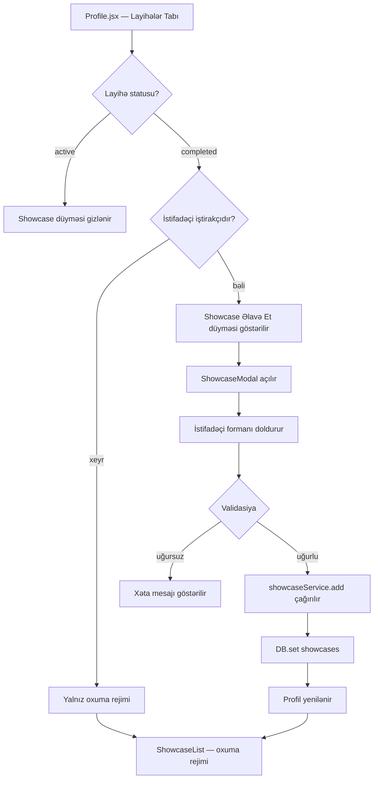

# Dizayn Sənədi: Project Showcase

## İcmal

Project Showcase xüsusiyyəti istifadəçilərə tamamlanmış layihələrə aid portfolio materialları (showcase elementləri) əlavə etmək, göstərmək və silmək imkanı verir. Məqsəd Behance, Dribbble, LinkedIn kimi platformalardakı portfolio nümayiş funksionallığını platforma daxilindəki layihə iş birliyi axınına inteqrasiya etməkdir.

Xüsusiyyət mövcud React + Vite SPA arxitekturasına, `localStorage`-əsaslı `DB` servisinə və `Profile.jsx` səhifəsinə inteqrasiya olunur. Yeni komponentlər mövcud dizayn sistemi (Tailwind CSS, `@iconify/react`, `ConfirmModal`) ilə uyğun şəkildə hazırlanır.

---

## Arxitektura

### Ümumi Axın



### Komponent Ağacı

```
Profile.jsx
├── ProjectCard (hər layihə üçün)
│   ├── ShowcaseList (tamamlanmış layihələr üçün)
│   │   └── ShowcaseItem (hər showcase elementi üçün)
│   │       └── [Sil düyməsi — yalnız sahibinə]
│   └── [Showcase Əlavə Et düyməsi — yalnız iştirakçılara]
└── ShowcaseModal (showcase əlavə etmə forması)
    └── ConfirmModal (silmə təsdiqi üçün)
```

### Məlumat Axını

- Bütün showcase məlumatları `DB.get('showcases')` / `DB.set('showcases', ...)` vasitəsilə `localStorage`-da saxlanılır.
- `showcaseService.js` bütün CRUD əməliyyatlarını mərkəzləşdirir.
- `Profile.jsx` showcase state-ini idarə edir və alt komponentlərə prop kimi ötürür.
- Showcase əlavə edildikdə və ya silindikdə `Profile.jsx` state-i dərhal yenilənir (re-render tetiklenir).

---

## Komponentlər və İnterfeyslər

### 1. `showcaseService.js` — `src/services/showcaseService.js`

Bütün showcase CRUD əməliyyatlarını ehtiva edən servis modulu.

```js
// Bütün showcase-ləri qaytarır
getAll(): Showcase[]

// Müəyyən layihəyə aid showcase-ləri qaytarır (createdAt azalan sırada)
getByProject(projectId: string): Showcase[]

// Yeni showcase əlavə edir; uğurlu olduqda yeni elementi qaytarır
add(data: ShowcaseInput): Showcase

// Showcase-i sil; uğurlu olduqda true qaytarır
remove(showcaseId: string): boolean

// İstifadəçinin layihənin iştirakçısı olub olmadığını yoxlayır
isParticipant(userId: string, project: Project): boolean

// URL validasiyası — http/https ilə başlamalıdır
isValidUrl(url: string): boolean

// Fayl ölçüsü validasiyası — 2MB limitini yoxlayır
isValidFileSize(sizeInBytes: number): boolean
```

### 2. `ShowcaseModal.jsx` — `src/components/profile/ShowcaseModal.jsx`

Showcase elementi yaratmaq üçün modal forma komponenti.

**Props:**
```js
{
  projectId: string,       // Showcase əlavə ediləcək layihənin id-si
  onClose: () => void,     // Modalı bağlamaq üçün callback
  onSaved: (showcase) => void  // Uğurlu saxlamadan sonra callback
}
```

**Daxili state:**
- `liveUrl` — canlı link (string)
- `description` — qısa açıqlama (string, maks. 300 simvol)
- `imageBase64` — base64 kodlanmış şəkil (string | null)
- `errors` — validasiya xətaları (object)
- `loading` — saxlama prosesi göstəricisi (boolean)

### 3. `ShowcaseList.jsx` — `src/components/profile/ShowcaseList.jsx`

Layihə kartı daxilindəki showcase elementlərinin siyahısı.

**Props:**
```js
{
  showcases: Showcase[],   // Göstəriləcək showcase elementləri
  currentUserId: string | null,  // Cari istifadəçinin id-si (null = qonaq)
  isOwnProfile: boolean,   // Profil sahibi baxırmı?
  onDelete: (id: string) => void  // Silmə callback-i
}
```

### 4. `ShowcaseItem.jsx` — `src/components/profile/ShowcaseItem.jsx`

Tək bir showcase elementini render edən komponent.

**Props:**
```js
{
  showcase: Showcase,
  canDelete: boolean,      // Silmə düyməsini göstər/gizlət
  onDelete: () => void
}
```

### 5. `Profile.jsx` — Mövcud komponentə əlavələr

Mövcud `Profile.jsx`-ə aşağıdakı dəyişikliklər edilir:

- `showcases` state-i əlavə edilir: `useState([])`
- `useEffect` daxilindəki layihə yükləmə hissəsinə showcase yükləmə əlavə edilir
- `handleAddShowcase(showcase)` — yeni showcase əlavə etmə handler-i
- `handleDeleteShowcase(id)` — showcase silmə handler-i
- `projectToDeleteShowcaseId` state-i — silmə təsdiqi üçün
- Layihə kartı render hissəsinə `ShowcaseList` və "Showcase Əlavə Et" düyməsi əlavə edilir

---

## Məlumat Modelləri

### `Showcase` Obyekti

```js
{
  id: string,           // uid() ilə generasiya edilmiş unikal identifikator
  projectId: string,    // Layihənin id-si
  userId: string,       // Showcase-i əlavə edən istifadəçinin id-si
  liveUrl: string | null,     // Canlı link (könüllü, http/https ilə başlamalı)
  image: string | null,       // Base64 kodlanmış şəkil (könüllü, maks. 2MB)
  description: string | null, // Qısa açıqlama (könüllü, maks. 300 simvol)
  createdAt: number           // Unix timestamp (Date.now())
}
```

### `ShowcaseInput` (forma məlumatları)

```js
{
  projectId: string,
  userId: string,
  liveUrl?: string,
  image?: string,       // Base64
  description?: string
}
```

### localStorage Strukturu

| Açar | Tip | Məzmun |
|------|-----|--------|
| `lu_showcases` | `Showcase[]` | Bütün showcase elementlərinin massivi |

### Mövcud `Project` Obyekti (dəyişdirilmir)

```js
{
  id: string,
  title: string,
  desc: string,
  authorId: string,
  skills: string[],
  team: string,
  status: 'active' | 'completed',
  createdAt: number,
  applicants: Applicant[],
  grad: string
}
```

### İştirakçılıq Yoxlaması

İstifadəçi aşağıdakı hallarda layihənin iştirakçısı sayılır:
1. `project.authorId === userId` (layihənin müəllifi)
2. `project.applicants.some(a => a.userId === userId && a.status === 'accepted')` (qəbul edilmiş üzv)

---

## Düzgünlük Xüsusiyyətləri

*Xüsusiyyət (property) — sistemin bütün etibarlı icraları boyunca doğru olmalı olan davranış və ya xarakteristikadır. Xüsusiyyətlər insan tərəfindən oxunan spesifikasiyalar ilə maşın tərəfindən yoxlanıla bilən düzgünlük zəmanətləri arasında körpü rolunu oynayır.*

### Xüsusiyyət 1: Showcase Saxlama Round-Trip

*İstənilən* etibarlı showcase input kombinasiyası üçün (ən azı bir sahə dolu olmaqla), showcase əlavə edildikdən sonra `DB.get('showcases')` sorğusu həmin elementi `projectId`, `userId`, `createdAt` sahələri ilə birlikdə qaytarmalıdır.

**Yoxlayır: Tələb 1.3, Tələb 5.1, Tələb 5.2, Tələb 5.3**

---

### Xüsusiyyət 2: URL Validasiyası

*İstənilən* `http://` və ya `https://` ilə başlamayan string üçün `isValidUrl()` funksiyası `false` qaytarmalıdır; `http://` və ya `https://` ilə başlayan string üçün isə `true` qaytarmalıdır.

**Yoxlayır: Tələb 1.5**

---

### Xüsusiyyət 3: Fayl Ölçüsü Validasiyası

*İstənilən* fayl ölçüsü üçün: 2MB-dan (2 × 1024 × 1024 bayt) böyük ölçülər `isValidFileSize()` tərəfindən rədd edilməli, 2MB-dan kiçik və ya bərabər ölçülər isə qəbul edilməlidir.

**Yoxlayır: Tələb 1.6**

---

### Xüsusiyyət 4: İştirakçılıq Hüququ

*İstənilən* istifadəçi/layihə cütü üçün: `isParticipant()` funksiyası yalnız layihənin müəllifi (`authorId`) və ya qəbul edilmiş üzv (`applicants` massivindəki `status: 'accepted'`) olan istifadəçilər üçün `true` qaytarmalıdır. Digər bütün hallarda `false` qaytarmalıdır.

**Yoxlayır: Tələb 2.2, Tələb 2.3**

---

### Xüsusiyyət 5: Çoxlu Showcase Əlavə Etmə İnvariantı

*İstənilən* layihə və istifadəçi üçün, eyni layihəyə N showcase əlavə edildikdə, `DB.get('showcases')` həmin layihəyə aid N elementi qaytarmalıdır — əvvəlki elementlər silinmədən.

**Yoxlayır: Tələb 2.4**

---

### Xüsusiyyət 6: Showcase Sıralama İnvariantı

*İstənilən* showcase siyahısı üçün, `getByProject()` funksiyasının qaytardığı siyahıda hər element özündən sonrakı elementdən daha böyük və ya bərabər `createdAt` dəyərinə malik olmalıdır (azalan sıra).

**Yoxlayır: Tələb 3.5**

---

### Xüsusiyyət 7: Showcase Silmə Round-Trip

*İstənilən* showcase elementi üçün: əlavə edildikdən sonra silinərsə, `DB.get('showcases')` həmin `id`-yə malik elementi artıq qaytarmamalıdır.

**Yoxlayır: Tələb 4.3**

---

### Xüsusiyyət 8: Showcase Render Tamlığı

*İstənilən* showcase obyekti üçün, `ShowcaseItem` komponenti render edildikdə: mövcud olan sahələr (`liveUrl`, `image`, `description`) DOM-da göstərilməli, `null` olan sahələr isə göstərilməməlidir.

**Yoxlayır: Tələb 3.2**

---

## Xəta İdarəetməsi

### Validasiya Xətaları (Forma Səviyyəsində)

| Ssenari | Xəta Mesajı | Davranış |
|---------|-------------|----------|
| Bütün sahələr boşdur | "Ən azı bir sahəni doldurun" | Forma saxlanılmır |
| URL etibarsız formatdadır | "URL http:// və ya https:// ilə başlamalıdır" | Forma saxlanılmır |
| Şəkil 2MB-dan böyükdür | "Şəkil 2MB-dan kiçik olmalıdır" | Fayl seçilmir |
| Açıqlama 300 simvoldan uzundur | Simvol sayacı qırmızıya dönür | Forma saxlanılmır |

### localStorage Xətaları

- `DB.get('showcases')` boş massiv qaytarırsa (parse xətası), sistem boş massivlə davam edir.
- `DB.set()` uğursuz olarsa (localStorage dolu), konsola xəta yazılır və istifadəçiyə ümumi xəta mesajı göstərilir.

### Kenar Hallar

- **Silinmiş layihə**: Layihə silinibsə, ona aid showcase-lər `showcases` açarında qalır, lakin profildə göstərilmir (layihə tapılmadığı üçün).
- **Silinmiş istifadəçi**: Showcase-in `userId`-si mövcud olmayan istifadəçiyə işarə edirsə, silmə düyməsi göstərilmir.
- **Boş `applicants` massivi**: `project.applicants` `undefined` olarsa, `isParticipant()` bunu boş massiv kimi qəbul edir.

---

## Test Strategiyası

### İkili Test Yanaşması

Xüsusiyyət həm nümunə-əsaslı (unit), həm də xüsusiyyət-əsaslı (property-based) testlərlə əhatə olunur.

**Unit Testlər** (`src/test/projectShowcase.test.jsx`):
- `ShowcaseModal` render testi — 3 sahənin mövcudluğu (Tələb 1.2)
- Boş forma göndərmə — xəta mesajının göründüyü (Tələb 1.4)
- Canlı link `target="_blank"` atributu (Tələb 3.3)
- Showcase-siz tamamlanmış layihə — "Hələ showcase yoxdur" mesajı (Tələb 3.4)
- Silmə düyməsinə basıldıqda `ConfirmModal`-ın açılması (Tələb 4.2)
- Silmə ləğv edildikdə localStorage-ın dəyişməməsi (Tələb 4.4)
- Başqa istifadəçinin profilindəki showcase-lərin oxuma rejimində göstərilməsi (Tələb 6.1, 6.2)

**Property-Based Testlər** (`src/test/projectShowcase.property.test.js`):

Test kitabxanası: **fast-check** (artıq `devDependencies`-də mövcuddur)
Minimum iterasiya: **100** hər xüsusiyyət üçün

| Test | Xüsusiyyət | Tələb |
|------|-----------|-------|
| Showcase saxlama round-trip | Xüsusiyyət 1 | 1.3, 5.1–5.3 |
| URL validasiyası | Xüsusiyyət 2 | 1.5 |
| Fayl ölçüsü validasiyası | Xüsusiyyət 3 | 1.6 |
| İştirakçılıq hüququ | Xüsusiyyət 4 | 2.2, 2.3 |
| Çoxlu showcase əlavə etmə | Xüsusiyyət 5 | 2.4 |
| Sıralama invariantı | Xüsusiyyət 6 | 3.5 |
| Silmə round-trip | Xüsusiyyət 7 | 4.3 |
| Render tamlığı | Xüsusiyyət 8 | 3.2 |

**Test Teq Formatı:**
```js
// Feature: project-showcase, Property 1: Showcase saxlama round-trip
// Feature: project-showcase, Property 2: URL validasiyası
// ...
```

### İnteqrasiya Testləri

- `Profile.jsx` ilə `showcaseService.js` inteqrasiyası — showcase əlavə etmə axını
- `ConfirmModal` ilə silmə axını

### Test Mühiti

Mövcud test qurğusu (`src/test/setup.js`, `vitest`, `@testing-library/react`, `jsdom`) dəyişdirilmədən istifadə edilir. localStorage `vi.stubGlobal` ilə mock edilir (mövcud test fayllarındakı pattern izlənilir).
