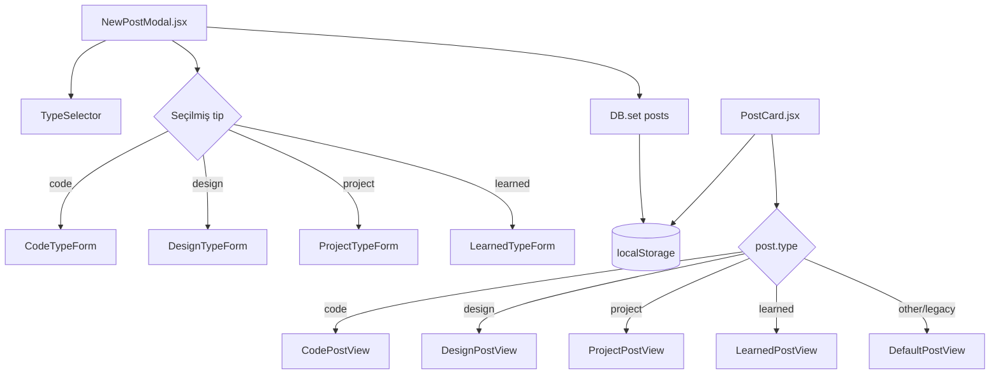

# Design Document: Rich Post Types

## Overview

Bu dizayn, LinkUp platformasının mövcud post sistemini genişləndirir. Hazırda `NewPostModal.jsx` sadə mətn + şəkil + kateqoriya seçimi təklif edir; `PostCard.jsx` isə bütün postları eyni şablonla render edir. Məqsəd: hər post tipinin (`code`, `design`, `project`, `learned`) öz xüsusi sahə formu, məlumat strukturu və feed görünüşü olsun.

Mövcud arxitektura saxlanılır — yeni komponentlər mövcud komponentlərə inteqrasiya edilir, ayrı səhifə yaradılmır. Köhnə postlarla geriyə uyğunluq qorunur.

---

## Architecture



**Əsas prinsiplər:**
- `NewPostModal.jsx` içərisindəki `POST_TYPES` massivi `learned` tipi ilə genişləndirilir
- Hər tip üçün ayrı form komponenti (inline və ya ayrı fayl) yaradılır
- `PostCard.jsx` `post.type` əsasında fərqli render blokları göstərir
- `DB` strukturu `metadata` sahəsi ilə genişləndirilir, mövcud sahələr dəyişdirilmir
- Syntax highlighting üçün `react-syntax-highlighter` kitabxanası istifadə edilir

---

## Components and Interfaces

### 1. `NewPostModal.jsx` — Genişləndirilmiş

**Dəyişikliklər:**
- `POST_TYPES` massivinə `learned` tipi əlavə edilir
- `metadata` state-i əlavə edilir: `const [metadata, setMetadata] = useState({})`
- Tip dəyişdikdə `metadata` sıfırlanır
- `handlePost` funksiyası `metadata` sahəsini DB-yə yazır
- Hər tip üçün `<TypeForm>` komponenti render edilir

**Yeni state:**
```js
const [metadata, setMetadata] = useState({});
// tip dəyişdikdə: setMetadata({})
```

**Yenilənmiş `handlePost`:**
```js
const newPost = {
  id: 'post_' + uid(),
  authorId: currentUser.id,
  caption,
  type: postType,
  image,
  metadata,          // YENİ
  likes: [],
  comments: [],
  createdAt: Date.now()
};
```

**Publish düyməsinin deaktivliyi** — tip-spesifik validasiya:
```js
const isPublishDisabled = () => {
  if (!caption.trim()) return true;
  if (postType === 'code') return !metadata.code?.trim();
  if (postType === 'design') return !image && !metadata.designLink?.trim();
  if (postType === 'project') return !metadata.projectName?.trim();
  if (postType === 'learned') return !metadata.topic?.trim();
  return false;
};
```

---

### 2. Type Form Komponentləri (NewPostModal içərisində)

#### `CodeTypeForm`
```
Props: { metadata, onChange }
Sahələr:
  - language: <select> — JS, TS, Python, Dart, Java, C++, HTML, CSS, SQL, Bash
  - code: <textarea> — font-mono, min-h-[200px]
```

#### `DesignTypeForm`
```
Props: { metadata, onChange, image, onImageChange }
Sahələr:
  - image: mövcud şəkil yükləmə (NewPostModal-dan köçürülür)
  - designLink: <input type="url">
  - tools: çoxlu seçim — Figma, Adobe XD, Sketch, Illustrator, Photoshop, Canva, Framer, Webflow
```

#### `ProjectTypeForm`
```
Props: { metadata, onChange }
Sahələr:
  - projectName: <input>
  - description: <textarea>
  - technologies: tag input (vergüllə ayrılmış)
  - githubUrl: <input type="url">
  - demoUrl: <input type="url">
```

#### `LearnedTypeForm`
```
Props: { metadata, onChange }
Sahələr:
  - topic: <input>
  - level: radio/button group — beginner | intermediate | advanced
  - notes: <textarea>
  - sourceUrl: <input type="url">
```

---

### 3. `PostCard.jsx` — Genişləndirilmiş

**Yeni render blokları** (mövcud "Content" bölməsinin içərisində):

#### `CodePostView`
- `react-syntax-highlighter` ilə syntax highlighting
- Dil etiketi (sol üst)
- "Kopyala" düyməsi (sağ üst) — `navigator.clipboard.writeText()`
- Kopyalandıqda 2 saniyə "Kopyalandı ✓" göstərilir

#### `DesignPostView`
- Şəkil tam genişlikdə (mövcud davranış)
- Alət etiketləri (tools array-dən)
- "Dizayna Bax" düyməsi (designLink varsa)

#### `ProjectPostView`
- Layihə adı — başlıq kimi
- Texnologiya tag-ları — rəngli pill-lər
- GitHub düyməsi (githubUrl varsa)
- "Canlı Demo" düyməsi (demoUrl varsa)

#### `LearnedPostView`
- Mövzu adı — başlıq kimi
- Səviyyə badge-i — beginner→yaşıl, intermediate→sarı, advanced→qırmızı
- Qeydlər (notes)
- "Mənbəyə Bax" düyməsi (sourceUrl varsa)

**`POST_TYPES` genişləndirilməsi** (PostCard-da):
```js
const POST_ICONS = {
  design: 'mdi:palette-outline',
  code: 'mdi:code-braces',
  project: 'mdi:rocket-launch-outline',
  learned: 'mdi:lightbulb-outline',   // YENİ
  other: 'mdi:star-four-points-outline'
};

const POST_LABELS = {
  design: 'bg-pink-500/10 text-pink-400 border-pink-500/20',
  code: 'bg-cyan-500/10 text-cyan-400 border-cyan-500/20',
  project: 'bg-green-500/10 text-green-400 border-green-500/20',
  learned: 'bg-amber-500/10 text-amber-400 border-amber-500/20',  // YENİ
  other: 'bg-amber-500/10 text-amber-400 border-amber-500/20'
};
```

---

## Data Models

### Mövcud Post Strukturu (dəyişdirilmir)
```js
{
  id: string,
  authorId: string,
  caption: string,
  type: 'code' | 'design' | 'project' | 'learned' | 'other',
  image: string,
  likes: string[],
  comments: object[],
  createdAt: number
}
```

### Yeni `metadata` Sahəsi (əlavə edilir)
```js
metadata: {
  // code tipi üçün:
  language: string,   // 'JavaScript' | 'Python' | ...
  code: string,

  // design tipi üçün:
  designLink: string,
  tools: string[],    // ['Figma', 'Adobe XD', ...]

  // project tipi üçün:
  projectName: string,
  description: string,
  technologies: string[],
  githubUrl: string,
  demoUrl: string,

  // learned tipi üçün:
  topic: string,
  level: 'beginner' | 'intermediate' | 'advanced',
  notes: string,
  sourceUrl: string
}
```

### Geriyə Uyğunluq
- `metadata` sahəsi olmayan köhnə postlar `other` tipi kimi render edilir
- `PostCard` `post.metadata?.field` optional chaining istifadə edir
- Seed data-dakı mövcud postlar dəyişdirilmir

### Texnologiya Tag Parsing
```js
// Daxiletmə: "React, Node.js, TypeScript"
// Çıxış: ["React", "Node.js", "TypeScript"]
const parseTechnologies = (input) =>
  input.split(',').map(t => t.trim()).filter(Boolean);
```

---

## Correctness Properties

*A property is a characteristic or behavior that should hold true across all valid executions of a system — essentially, a formal statement about what the system should do. Properties serve as the bridge between human-readable specifications and machine-verifiable correctness guarantees.*

### Property 1: Tip seçimi düzgün formu göstərir

*For any* post type in `{code, design, project, learned}`, selecting that type in `NewPostModal` should render exactly the fields defined for that type and should not render fields belonging to other types.

**Validates: Requirements 1.2, 1.4**

---

### Property 2: Tip dəyişdikdə metadata sıfırlanır

*For any* two distinct post types A and B, filling in type A's metadata fields and then switching to type B should result in an empty metadata state (no A-specific values retained).

**Validates: Requirements 1.3**

---

### Property 3: Dəstəklənən dillər dropdown-da mövcuddur

*For any* language in the required set `{JavaScript, TypeScript, Python, Dart, Java, C++, HTML, CSS, SQL, Bash}`, it must appear as a selectable option in the code type's language dropdown.

**Validates: Requirements 2.2**

---

### Property 4: Kod postu kod bloku kimi render edilir

*For any* post with `type === 'code'` and any non-empty `metadata.code` string and any `metadata.language`, `PostCard` should render a syntax-highlighted code block containing the code content and displaying the language as a label.

**Validates: Requirements 2.4, 2.5**

---

### Property 5: Dizayn alətləri etiket kimi render edilir

*For any* design post with any non-empty `metadata.tools` array, `PostCard` should render each tool in the array as a visible tag element.

**Validates: Requirements 3.2, 3.4**

---

### Property 6: Texnologiya tag parsing round-trip

*For any* non-empty array of technology strings (with no leading/trailing whitespace), joining them with `", "` and then parsing via `parseTechnologies` should produce an array equal to the original.

**Validates: Requirements 4.2**

---

### Property 7: Layihə postu adı və texnologiyaları render edir

*For any* project post with any `metadata.projectName` and any `metadata.technologies` array, `PostCard` should render the project name as a heading element and each technology as a colored tag element.

**Validates: Requirements 4.3**

---

### Property 8: Öyrəndim postu mövzu və səviyyəni render edir

*For any* learned post with any `metadata.topic` and any `metadata.level` in `{beginner, intermediate, advanced}`, `PostCard` should render the topic as a heading and the level badge with the correct color class (green/yellow/red respectively).

**Validates: Requirements 5.3, 5.4**

---

### Property 9: Post yaradılarkən data bütövlüyü qorunur

*For any* post type and any valid metadata, creating a post via `NewPostModal` should save a DB record that: (a) contains `type`, `caption`, and `metadata` fields with correct values, (b) preserves `likes`, `comments`, `createdAt`, `authorId` fields, and (c) `metadata` contains the type-specific fields that were filled in.

**Validates: Requirements 7.1, 7.3, 7.5**

---

### Property 10: Hər post tipi üçün Type_Badge render edilir

*For any* post with any type value (including legacy posts without metadata), `PostCard` should render a type badge element without throwing an error.

**Validates: Requirements 6.2, 7.4**

---

## Error Handling

### Köhnə Post Uyğunluğu
```js
// PostCard-da hər metadata oxumasında optional chaining
const code = post.metadata?.code ?? '';
const language = post.metadata?.language ?? 'JavaScript';
const tools = post.metadata?.tools ?? [];
const technologies = post.metadata?.technologies ?? [];
const level = post.metadata?.level ?? 'beginner';
```

### Syntax Highlighter Xətası
- `react-syntax-highlighter` yükləmə xətasında fallback: `<pre><code>` bloku
- Naməlum dil adı üçün highlighter default davranışı istifadə edir

### Clipboard API
```js
const handleCopy = async () => {
  try {
    await navigator.clipboard.writeText(code);
    setCopied(true);
    setTimeout(() => setCopied(false), 2000);
  } catch {
    // Fallback: document.execCommand('copy') — köhnə brauzer dəstəyi
  }
};
```

### Xarici Linklər
- Bütün xarici linklər `target="_blank" rel="noopener noreferrer"` ilə açılır
- Boş/undefined link dəyərləri üçün düymə render edilmir (optional chaining ilə yoxlanılır)

### Form Validasiyası
- Publish düyməsi tip-spesifik məcburi sahə boş olduqda `disabled` olur
- Boş string, yalnız boşluqlardan ibarət string `.trim()` ilə yoxlanılır

---

## Testing Strategy

### Dual Testing Approach

**Unit / Example Tests** (Vitest + React Testing Library):
- Hər tip üçün form sahələrinin render olunması (1.1, 2.1, 3.1, 4.1, 5.1, 5.2)
- Default tip (`learned`) davranışı (1.5)
- Köhnə post geriyə uyğunluğu (7.2, 7.4)
- Şərti render: GitHub düyməsi, Demo düyməsi, Dizayna Bax, Mənbəyə Bax (3.5, 4.4, 4.5, 5.5)
- Kopyala düyməsi mövcudluğu (2.6) və clipboard davranışı (2.7)
- i18n açarlarının mövcudluğu (8.1–8.4)

**Edge Case Tests:**
- Boş kod sahəsi → publish disabled (2.8)
- Boş şəkil + boş dizayn linki → publish disabled (3.6)
- Boş layihə adı → publish disabled (4.6)
- Boş mövzu adı → publish disabled (5.6)
- `metadata` olmayan post → xəta yox (7.4)

**Property-Based Tests** (fast-check):

PBT bu feature üçün uyğundur: `parseTechnologies`, metadata saxlama, PostCard rendering funksiyaları aydın input/output davranışına malikdir və input variasiyası edge case-ləri aşkar edə bilər.

Hər property testi minimum **100 iterasiya** ilə işləməlidir.

Tag format: `// Feature: rich-post-types, Property N: <property_text>`

| Property | Test faylı | fast-check generator |
|---|---|---|
| P1: Tip formu | `NewPostModal.test.jsx` | `fc.constantFrom('code','design','project','learned')` |
| P2: Metadata sıfırlanması | `NewPostModal.test.jsx` | `fc.tuple(fc.constantFrom(...types), fc.constantFrom(...types)).filter(([a,b])=>a!==b)` |
| P3: Dil dropdown | `NewPostModal.test.jsx` | `fc.constantFrom(...REQUIRED_LANGUAGES)` |
| P4: Kod bloku render | `PostCard.test.jsx` | `fc.record({ code: fc.string({minLength:1}), language: fc.constantFrom(...langs) })` |
| P5: Alət etiketləri | `PostCard.test.jsx` | `fc.array(fc.constantFrom(...TOOLS), {minLength:1})` |
| P6: Tag parsing round-trip | `utils.test.js` | `fc.array(fc.string({minLength:1}).map(s=>s.trim()).filter(s=>s&&!s.includes(',')), {minLength:1})` |
| P7: Layihə render | `PostCard.test.jsx` | `fc.record({ projectName: fc.string({minLength:1}), technologies: fc.array(fc.string({minLength:1}), {minLength:1}) })` |
| P8: Öyrəndim render | `PostCard.test.jsx` | `fc.record({ topic: fc.string({minLength:1}), level: fc.constantFrom('beginner','intermediate','advanced') })` |
| P9: Data bütövlüyü | `db.test.js` | `fc.record({ type: fc.constantFrom(...types), caption: fc.string({minLength:1}), metadata: fc.object() })` |
| P10: Type badge | `PostCard.test.jsx` | `fc.record({ type: fc.option(fc.constantFrom(...allTypes)), metadata: fc.option(fc.object()) })` |

**Kitabxana seçimi:** `fast-check` (TypeScript/JavaScript üçün ən geniş yayılmış PBT kitabxanası, Vitest ilə tam uyğun).

```bash
npm install --save-dev fast-check
```
